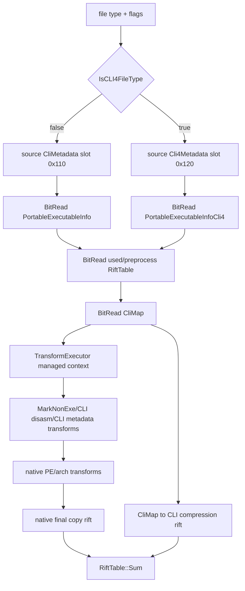

# Managed CLI Atoms

This document scopes the managed/.NET part of the PA30 PE pipeline as
implementation atoms. It is based on the current `msdelta.dll` disassembly pass
over `PreProcessPEForApply`, `PortableExecutableInfo[Cli4]`,
`CliMetadata`/`Cli4Metadata`, `CliMap`, `CompressionRiftTableCli[4]`,
`TransformCli[4]Disasm`, `TransformCli[4]Metadata`, `MarkNonExe::RunCli[4]`,
and the CreateDelta graph strings.

The near-term goal is decode/apply support. Create-side atoms are listed because
the native graph exposes them, but they should not block the first parser and
apply milestones.

## Terminology

`CLI` in these symbols means the ECMA-335 Common Language Infrastructure
metadata/IL path. It is not the command-line interface.

`CLI4` is also a native file-type branch. `IsCLI4FileType` returns true for
file types `0x10`, `0x20`, `0x40`, and `0x80`, and false for `0x2`, `0x4`, and
`0x8`. A managed PE can therefore appear in the classic CLI branch when the
file type is `0x2`, `0x4`, or `0x8`; managed does not imply CLI4.

## Apply Path

The native apply path is a state machine over a transformed source PE and a
copy-placement rift:



Important ordering:

1. Read source PE and extract source CLI metadata before the transform chain.
2. Read target PE info from the preprocess bitstream.
3. Read the used/preprocess `RiftTable`.
4. Read `CliMap`.
5. Run the transform chain with `CliMetadata`/`Cli4Metadata` and `CliMap` set on
   each transform object.
6. Build the native PE-copy rift and sum it with the CLI map rift.

## File-Type Branches

| Branch | File types | PE info reader | Source metadata | Target metadata | Transform flags |
|---|---|---|---|---|---|
| classic CLI | `0x2`, `0x4`, `0x8` when CLR metadata exists | `PortableExecutableInfo::FromBitReader` | `CliMetadata` | `CliMetadata` | `0x4000`, `0x8000` |
| CLI4 | `0x10`, `0x20`, `0x40`, `0x80` | `PortableExecutableInfoCli4::FromBitReader` | `Cli4Metadata` | `Cli4Metadata` | `0x200000`, `0x400000` |

Both branches share most wire structures. The main difference is which metadata
slot is populated and which static metadata schema table is used.

## Bitstream Structures

### PortableExecutableInfo

Native reference:

- `PortableExecutableInfo::FromBitReader`
- `PortableExecutableInfoCli4::FromBitReader`

Wire layout:

```text
u64 image_base
u32 field1
u32 time_date_stamp
RiftTable target_rva_to_file_offset
CliMetadata or Cli4Metadata target_metadata
```

The CLI4 reader uses the same first fields as the classic reader, but stores
the metadata object in the CLI4 metadata slot.

### CliMetadata

Native reference:

- `CliMetadata::FromBitReader`
- `CliMetadata::Init`
- `Cli4Metadata::Init`
- `CliMetadata::CheckStaticData`
- `Cli4Metadata::CheckStaticData`

Wire layout:

```text
bit present
if present == 0:
  empty metadata
else:
  u32 metadata_file_offset
  u32 metadata_size
  u32 metadata_rva
  u32 stream_count
  u32 stream_headers_end
  u32 strings_offset
  u32 strings_size
  u32 user_strings_offset
  u32 user_strings_size
  u32 blob_offset
  u32 blob_size
  u32 guid_offset
  u32 guid_size
  u32 tables_offset
  u32 tables_size
  bit wide_strings_heap
  bit wide_guid_heap
  bit wide_blob_heap
  u64 valid_table_mask
  for table_id in 0..64:
    if valid_table_mask bit table_id is set:
      u32 row_count
    else:
      row_count = 0
```

Derived state after parsing:

- 64 row counts.
- Per-table row byte sizes.
- Per-table file offsets for the first row.
- Per-column byte widths: 2 or 4 bytes.
- Per-column byte offsets inside each row.
- Static table schema checks.

The PE scanner (`CliMetadata::Init` and `Cli4Metadata::Init`) derives the same
model from a real metadata root. It validates the `BSJB` metadata root, stream
header bounds, duplicate stream names, `#~`, `#Strings`, `#US`, `#Blob`, and
`#GUID` offsets and sizes.

### CliMap

Native reference:

- `CliMap::FromBitReader`
- `CliMap::MapCoded`
- `CliMap::MapCodedExact`

Wire layout:

```text
bit present
if present == 0:
  empty rift tables:
    strings heap
    user strings heap
    blob heap
    guid heap
    64 metadata table maps
else:
  IntFormat heap_source_format
  IntFormat heap_target_format
  IntFormat table_source_format
  IntFormat table_target_format
  RiftTable strings_heap_map using heap formats
  RiftTable user_strings_heap_map using heap formats
  RiftTable blob_heap_map using heap formats
  RiftTable guid_heap_map using table formats
  for table_id in 0..64:
    RiftTable table_map using table formats
```

These are shared-format rift maps, not full standalone `RiftTable` records.
The four `IntFormat` values are read once and reused for every heap/table map.
Each individual map is then a signed entry count followed by
source-delta/offset-delta pairs. The semantic entry is
`source_acc -> source_acc + offset_acc`. A populated `CliMap` can still contain
empty individual maps; those are represented as count `0`, not as nested
present bits.

`CliMap::MapCoded(kind, value)` uses a native coded-token descriptor table:

```text
tag_bits = coded_schema[kind].tag_bits
tag = value & ((1 << tag_bits) - 1)
rid = value >> tag_bits
target_table = coded_schema[kind].tag_to_table[tag]
```

If `target_table == 0x40`, the token is identity. Otherwise the RID is mapped
through the `CliMap` table rift for `target_table` and reassembled with the
original tag. `MapCodedExact` is the same operation, but returns
`0xffffffff` when the RID has no exact map.

## Apply Atoms

### ManagedFileTypeBranch

Native reference: `IsCLI4FileType`

Inputs: final PA file type after the broader `PeMachineClassifier` /
`DetermineFileType` step. PE machine and `file_type_set` coverage stay with
that classifier; this atom is the pure managed branch split.

Transition: select classic CLI or CLI4 metadata branch. This does not itself
prove a PE is managed; it only selects where managed metadata would be read if
the file carries CLI metadata.

Outputs: `ManagedBranch::Classic` or `ManagedBranch::Cli4`.

Done when: file type classification tests cover `0x2`, `0x4`, `0x8`, `0x10`,
`0x20`, `0x40`, and `0x80`, and normal apply diagnostics identify the selected
managed branch while the downstream parsers are still unsupported.

### ManagedPeInfoBitstream

Native reference: `PortableExecutableInfo::FromBitReader`,
`PortableExecutableInfoCli4::FromBitReader`

Inputs: preprocess bitstream and managed branch.

Transition: parse PE target info, target RVA-to-file-offset rift, and the
correct target metadata object.

Outputs: typed `ManagedPeInfo { image_base, field1, time_date_stamp,
target_rva_to_file_offset, target_metadata }`.

Failure conditions: truncated scalar fields, malformed rift table, malformed
metadata bitstream.

Oracle strategy: parser round-trip first; then native stage dump comparing the
target info split fields and rift entries.

### CliMetadataStaticSchema

Native reference: `CliMetadata::CheckStaticData`, `Cli4Metadata::CheckStaticData`

Inputs: extracted static tables for classic CLI and CLI4.

Transition: expose the 64-table schema: column count, column kind, referenced
table/coded-token kind, and coded-token descriptor map.

Outputs: immutable schema tables used by metadata parsing, metadata transforms,
and coded-token remapping.

Failure conditions: schema table fails the same self-consistency checks as the
native `CheckStaticData` path.

Done when: static schema extraction is represented as Rust data, the
self-checks pass, and classic-vs-CLI4 differences are explicit in tests.

Current state: `src/pe/cli_schema.rs` now contains the pure static ECMA-335
table schema and coded-token descriptor model used by downstream metadata
parsers and transforms. It covers the 45 standard metadata tables, 13
coded-token descriptors, heap/table/coded index width calculation, and row-size
calculation. Classic CLI and CLI4 have separate schema handles even though they
currently share the same table/coded descriptor arrays.

Native evidence from the Windows Server 2025 `msdelta.dll` hash used in the
Frida fixture (`ac96e0c3...f4358eb`) confirms that the DLL carries the relevant
managed graph and schema labels, including `BitReadCliMetadata`,
`BitReadCliMap`, `RiftTransformCliMetadata`, `RiftTransformCli4Metadata`,
`CompressionRiftTableFromCliMap`, `CompressionRiftTableFromCli4Map`,
`CliMetadata`, `TypeDefOrRef`, `MemberRefParent`, `MethodDefOrRef`, and
`TypeOrMethodDef`. That is enough to tie this Rust atom to the native managed
path, but not enough to call the schema native-validated. The next oracle step
is a symbol-map hook or object normalizer around the native `CheckStaticData`
path.

### CliMetadataFromPe

Native reference: `CliMetadata::Init`, `Cli4Metadata::Init`

Inputs: PE image bytes, CLR metadata directory location and size, managed
branch.

Transition: parse the metadata root and stream headers and derive the same
metadata model as the bitstream parser.

Outputs: `CliMetadataModel` with stream ranges, heap width flags, row counts,
table offsets, column offsets, and row sizes.

Failure conditions: missing `#~`, invalid `BSJB`, duplicate streams, out of
bounds stream ranges, too-small table stream, malformed row-count array.

Done when: a real managed PE can produce a `CliMetadataModel` without reading a
delta, and that model matches the target metadata model for equal inputs.

Current state: `src/pe/cli_metadata.rs` parses the PE CLR runtime header,
`BSJB` metadata root, stream headers, and `#~` table stream into a
`CliMetadataModel`. The model records metadata RVA/file offset/size, version
string, `#Strings`/`#US`/`#Blob`/`#GUID`/`#~` stream ranges, heap index widths,
valid/sorted table masks, row counts, row byte sizes, and first-row file
offsets. Tests cover synthetic PE32 and PE32+ managed images, duplicate stream
names, missing `#~`, truncated table rows, and an optional real BGPCore managed
assembly from the local ignored corpus when present.

This atom is still not native-validated. The next evidence step is a curated
managed fixture plus a Frida stage/object oracle for native `CliMetadata::Init`
or a direct object-normalizer comparison.

### CliMetadataBitstream

Native reference: `CliMetadata::FromBitReader`

Inputs: preprocess bitstream at the metadata record.

Transition: parse the metadata record wire layout above and run dependent
schema initialization.

Outputs: `CliMetadataModel`.

No-op conditions: `present == 0` produces an empty model.

Done when: bitstream round-trip tests cover empty metadata, heap-width flag
combinations, sparse valid-table masks, and maximum table id `63`.

### CliMapBitstream

Native reference: `CliMap::FromBitReader`

Inputs: preprocess bitstream after the used/preprocess rift.

Transition: parse empty or populated heap/table rift maps with the four
`IntFormat` records that parameterize the rift readers.

Outputs: `CliMapModel { strings, user_strings, blob, guid, tables[64] }`.

No-op conditions: `present == 0` yields empty rifts for all maps.

Done when: parser round-trip tests cover empty maps, non-empty heap maps, and
at least one table map.

### CliCodedTokenMap

Native reference: `CliMap::MapCoded`, `CliMap::MapCodedExact`

Inputs: coded-token kind, encoded token value, `CliMapModel`.

Transition: split tag and RID using the static coded-token descriptor, remap
the RID through the selected table rift, then reassemble.

Outputs: mapped token value, or `0xffffffff` for exact-map miss.

Done when: unit tests cover every coded-token kind and every sentinel table id
`0x40`.

Current state: `src/pe/cli_map.rs` implements the pure coded-token algebra
against the static schema. It covers tag/RID split and reassembly, sentinel
table identity, null RID handling, identity when no table map is present,
piecewise non-exact RID mapping, exact RID lookup with the `0xffffffff` miss
sentinel, and mapped-RID overflow/zero checks. The current RID map type is a
semantic source-RID to target-RID model; the next step is to feed it from the
`CliMapBitstream` shared-format rift parser and confirm sentinel/exact behavior
against a native object oracle.

### TransformContextManaged

Native reference: `TransformExecutor::Run`, `TransformBase::SetCliMetadata`,
`TransformBase::SetCli4Metadata`, `TransformBase::SetCliMap`

Inputs: transform list, managed branch, source metadata, target metadata,
`CliMap`.

Transition: attach the correct metadata slots and `CliMap` to every transform
before executing the chain.

Outputs: transforms can read `CliMetadata` from slot `0x68`, `Cli4Metadata`
from slot `0x78`, and `CliMap` from slot `0x88` in native object terms.

Done when: a lab build can report the selected managed branch and enabled CLI
flags before running apply.

### MarkNonExeCliMethods

Native reference: `MarkNonExe::RunCli`, `MarkNonExe::RunCli4`

Inputs: source PE, section table, data-directory ranges, source CLI metadata,
method-body helper.

Transition: mark non-executable bytes as normal `MarkNonExe` does, then mark
method bodies found from the MethodDef table as executable-neutral bytes in the
hint map.

Outputs: updated hint/marker map for later transforms and LZX matching.

Done when: fixtures prove method bodies are marked by metadata-derived RVA
ranges, not just by PE section characteristics.

### TransformCliDisasm

Native reference: `TransformCliDisasm::Run`,
`TransformCli4Disasm::Run`

Inputs: transformed source PE, source metadata, `CliMap`, method-body helper.

Transition: for each MethodDef row, find the method body and scan IL opcodes.
For opcode operand kinds that carry metadata tokens, remap token RIDs through
the appropriate `CliMap` table rift. For user-string token type `0x70`, remap
the RID through the user-string heap rift. Switch operands are skipped by their
count and are not token-remapped.

Outputs: source image bytes rewritten in place.

Failure conditions: malformed method body bounds or truncated opcode operands
terminate the current method scan without panicking.

Done when: isolated IL fixtures cover one-byte opcodes, `0xfe` two-byte
opcodes, token operands, user-string operands, and switch operands.

### CliBlobCompressedInteger

Native reference: `CliBlobTransformer::GetNumber`, `CliMetadata::GetBlobContent`

Inputs: signature blob byte slice.

Transition: parse ECMA-style compressed unsigned integers with 1-, 2-, and
4-byte encodings; reject reserved and truncated encodings.

Outputs: decoded integer and consumed byte count.

Done when: unit/property tests cover boundary values `0x7f`, `0x80`, `0x3fff`,
`0x4000`, and the reserved high-bit encodings.

Current state: `src/pe/cli_blob.rs` implements the pure compressed unsigned
integer reader used by later signature blob transforms. It returns the decoded
value plus the consumed byte count, rejects truncated encodings, and rejects the
reserved `111xxxxx` prefix family. It does not yet enforce native behavior for
non-canonical encodings because that needs a small native `GetNumber` oracle
case first.

### CliBlobTypeTokenRemap

Native reference: `CliBlobTransformer::TransformTypeDef`,
`CliBlobTransformer::TransformType`, `CliBlobTransformer::TransformParam`,
`CliBlobTransformer::TransformSentinel`

Inputs: a signature blob cursor, `CliMap`, managed branch.

Transition: walk type signatures, modifiers, sentinels, parameter lists, and
TypeDefOrRef coded tokens. Rewrite embedded coded tokens with the matching
table rifts and preserve the original compressed integer width when possible.

Outputs: mutated signature blob bytes.

Failure conditions: malformed signatures stop the current blob transform
without failing the whole apply.

Done when: synthetic signatures exercise primitive types, class/value type
tokens, arrays/generic shapes, sentinels, custom modifiers, and varargs.

### TransformCliMetadata

Native reference: `TransformCliMetadata::Run`,
`TransformCli4Metadata::Run`, `CliBlobTransformer::TransformColumn`

Inputs: transformed source PE, source metadata, target metadata, `CliMap`.

Transition: walk every present metadata table and each schema-described column.
Simple heap/table/coded-index columns are remapped through the relevant
`CliMap` rifts. Blob signature columns collect referenced blob offsets, then
run `CliBlobTypeTokenRemap` on each unique blob.

Outputs: source metadata tables and selected blob signatures rewritten in
place.

Done when: table-column tests cover all schema column kinds used by
`CheckStaticData`, and blob transform tests are independent of full PE apply.

### CliHeapRift

Native reference: `CompressionRiftTableCli::AddHeapMap`,
`CompressionRiftTableFromCli4Map::AddHeapMap`

Inputs: source heap offset, target heap offset, heap rift from `CliMap`.

Transition: add a base mapping when the heap map is empty; otherwise convert
each heap-map entry into a file-offset rift contribution. Stop at the native
sentinel behavior for entries whose source exceeds `0xffffffff`.

Outputs: rift entries for `#Strings`, `#US`, and `#Blob`. Treat `#GUID` as
table-like for rift production even though it is exposed as a dedicated
`CliMap` slot.

Done when: unit tests cover empty heap map, leading zero entries, multiple
entries, and sentinel termination.

### CliTableRift

Native reference: `CompressionRiftTableCli::AddTableMap`,
`CompressionRiftTableFromCli[4]Map::AddTableMap`

Inputs: source table offset, target table offset, row size, table rift,
metadata schemas.

Transition: add row-start mappings using the table map. If source and target
column widths differ, add extra rift entries around widened or narrowed column
positions so copy placement follows the rewritten metadata row layout.

Outputs: rift entries for metadata table rows, `#GUID` pseudo-table rows, and
width-change holes.

Done when: tests cover row-count changes, row-size changes, 2-byte to 4-byte
index widening, 4-byte to 2-byte narrowing, and empty table maps.

### CliCompressionRift

Native reference: `CompressionRiftTableCli::FromCliMap`,
`CompressionRiftTableCli4::FromCli4Map`

Inputs: source metadata, target metadata, `CliMap`, transformed target buffer.

Transition: compose `CliHeapRift` for `#Strings`, `#US`, and `#Blob`; compose
`CliTableRift` for `#GUID` and each of the 64 metadata tables; sort the result.

Outputs: CLI rift in target-file-offset to source-file-offset terms.

No-op conditions: empty source or target metadata yields an empty rift.

Done when: native stage fixtures compare the sorted CLI rift before it is
summed into the final PE-copy rift.

### FinalPeCopyRiftManaged

Native reference: `PreProcessPEForApply`, `RiftTable::Sum`

Inputs: native PE-copy rift, CLI compression rift.

Transition: sum the native rift and CLI rift to produce the final caller rift
used by the decompressor copy stage.

Outputs: final copy rift.

Done when: fixture packets include `native_final_rift.tsv` for at least one
classic CLI and one CLI4 case.

## Create-Side Atoms

These are known from the native graph and disassembly but should wait until
apply-side models are stable.

| Atom | Native reference | Purpose |
|---|---|---|
| `CliMapFromPEs` | `CliMapFromPEs::Run` | Build classic `CliMap` from source/target PE metadata. |
| `Cli4MapFromPEs` | `Cli4MapFromPEs::Run` | Build CLI4 `CliMap` from source/target PE metadata. |
| `CliMapStringsHash` | `StringsStreamHashTable::Init` | Match `#Strings` entries between source and target. |
| `CliMapBlobAndRvas` | `ProcessBlobStreamAndRvas` | Match blob-stream entries and method RVA-derived records. |
| `CliMapSequenceTables` | `ProcessSequenceTable`, `ProcessTripletTable` | Match metadata rows using schema-specific row keys. |
| `GetPortableExecutableInfoManaged` | `GetPortableExecutableInfo`, `GetPortableExecutableInfoCli4` | Emit target PE info and target metadata for CreateDeltaB. |

## First Implementation Order

1. Implement `ManagedFileTypeBranch` as a pure classifier and use it in the
   fail-loud managed rejection path.
2. Implement pure schema/model atoms first: `CliMetadataStaticSchema`,
   `CliMetadataFromPe`, `CliBlobCompressedInteger`, and `CliCodedTokenMap`.
3. Add `CliMapModel` and the shared-format rift reader needed by
   `CliMapBitstream`.
4. Implement `CliMetadataBitstream` and `ManagedPeInfoBitstream` parser
   round-trips.
5. Implement `CliMapBitstream` parser round-trips.
6. Implement `CliHeapRift`, then `CliTableRift`, then `CliCompressionRift`.
7. Add native stage fixtures for `CliMetadataBitstream`, `CliMapBitstream`,
   `CliCompressionRift`, and `FinalPeCopyRiftManaged`.
8. Implement `MarkNonExeCliMethods`.
9. Implement `TransformCliDisasm`.
10. Implement `CliBlobTypeTokenRemap`.
11. Implement `TransformCliMetadata`.
12. Only then remove the managed `Error::Unsupported` gate for covered
    branches.

This order keeps the early atoms almost pure: they do not need to run LZX,
apply a full delta, or mutate a PE image. Native Frida work should run in
parallel starting with `CliMetadata::FromBitReader` object normalization, then
`CliMap::FromBitReader`, then `CompressionRiftTableCli[4]::FromCliMap`.
