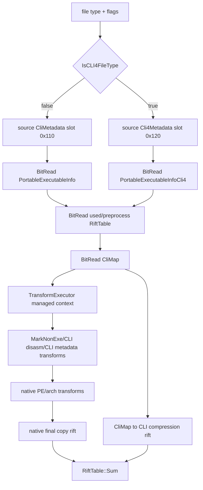

# Managed CLI Atoms

This document scopes the managed/.NET part of the PA30 PE pipeline as
implementation atoms. It is based on the current `msdelta.dll` disassembly pass
over `PreProcessPEForApply`, `PortableExecutableInfo[Cli4]`,
`CliMetadata`/`Cli4Metadata`, `CliMap`, `CompressionRiftTableCli[4]`,
`TransformCli[4]Disasm`, `TransformCli[4]Metadata`, `MarkNonExe::RunCli[4]`,
and the CreateDelta graph strings.

The near-term goal is decode/apply support. Create-side atoms are listed because
the native graph exposes them, but they should not block the first parser and
apply milestones.

Atom boundaries in this document are expected to move as native evidence
improves. Split an atom when a smaller transition can be independently
captured, fuzzed, and documented; keep it merged when the split would only name
an implementation helper with no separate oracle. When a lesson is about the
lab workflow rather than the managed behavior itself, update
`docs/feature-atoms.tsv` with a `lab` atom instead of inflating the managed
pipeline.

The implementation home for this work is `src/pe/cli/`. Treat it as a typed
CLR metadata subsystem, not as miscellaneous PE helper code:

| Module | Concern |
|---|---|
| `schema.rs` | static ECMA-335 table, column, heap, and coded-index schema |
| `metadata.rs` | CLR metadata root, typed rows/heaps, and MSDelta metadata-bitstream models |
| `map.rs` | semantic `CliMap`, MSDelta map bitstream, and coded-token remapping |
| `blob.rs` | compressed unsigned integers used by signature blobs |
| `create_map.rs` | create-side managed map producers split into testable atoms |
| `tokens.rs` | metadata table IDs, nonzero RIDs, raw metadata tokens, and typed heap offsets/indexes |

Future splits should move toward `root.rs`, `tables.rs`, `heaps.rs`,
`rows.rs`, `signatures.rs`, `map_bitstream.rs`, and
`metadata_bitstream.rs` as those concerns grow. Transforms should depend on
typed rows, heap offsets, RIDs, and tokens from this subsystem instead of
constructing magic offsets directly.

`#Strings`, `#US`, and `#Blob` use byte offsets into their heaps. `#GUID` uses
one-based indexes. Keep that distinction in the type system; otherwise metadata
transforms will eventually conflate two wire conventions that happen to be
encoded as integers.

## Terminology

`CLI` in these symbols means the ECMA-335 Common Language Infrastructure
metadata/IL path. It is not the command-line interface.

`CLI4` is also a native file-type branch. `IsCLI4FileType` returns true for
file types `0x10`, `0x20`, `0x40`, and `0x80`, and false for `0x2`, `0x4`, and
`0x8`. A managed PE can therefore appear in the classic CLI branch when the
file type is `0x2`, `0x4`, or `0x8`; managed does not imply CLI4.

## Apply Path

The native apply path is a state machine over a transformed source PE and a
copy-placement rift:



Important ordering:

1. Read source PE and extract source CLI metadata before the transform chain.
2. Read target PE info from the preprocess bitstream.
3. Read the used/preprocess `RiftTable`.
4. Read `CliMap`.
5. Run the transform chain with `CliMetadata`/`Cli4Metadata` and `CliMap` set on
   each transform object.
6. Build the native PE-copy rift and sum it with the CLI map rift.

## File-Type Branches

| Branch | File types | PE info reader | Source metadata | Target metadata | Transform flags |
|---|---|---|---|---|---|
| classic CLI | `0x2`, `0x4`, `0x8` when CLR metadata exists | `PortableExecutableInfo::FromBitReader` | `CliMetadata` | `CliMetadata` | `0x4000`, `0x8000` |
| CLI4 | `0x10`, `0x20`, `0x40`, `0x80` | `PortableExecutableInfoCli4::FromBitReader` | `Cli4Metadata` | `Cli4Metadata` | `0x200000`, `0x400000` |

Both branches share most wire structures. The main difference is which metadata
slot is populated and which static metadata schema table is used.

## Bitstream Structures

### PortableExecutableInfo

Native reference:

- `PortableExecutableInfo::FromBitReader`
- `PortableExecutableInfoCli4::FromBitReader`

Wire layout:

```text
u64 image_base
u32 field1
u32 time_date_stamp
RiftTable target_rva_to_file_offset
CliMetadata or Cli4Metadata target_metadata
```

The CLI4 reader uses the same first fields as the classic reader, but stores
the metadata object in the CLI4 metadata slot.

### CliMetadata

Native reference:

- `CliMetadata::FromBitReader`
- `CliMetadata::Init`
- `Cli4Metadata::Init`
- `CliMetadata::CheckStaticData`
- `Cli4Metadata::CheckStaticData`

Wire layout:

```text
bit present
if present == 0:
  empty metadata
else:
  u32 metadata_file_offset
  u32 metadata_size
  u32 metadata_rva
  u32 stream_count
  u32 stream_headers_end
  u32 strings_offset
  u32 strings_size
  u32 user_strings_offset
  u32 user_strings_size
  u32 blob_offset
  u32 blob_size
  u32 guid_offset
  u32 guid_size
  u32 tables_offset
  u32 tables_size
  bit wide_strings_heap
  bit wide_guid_heap
  bit wide_blob_heap
  u64 valid_table_mask
  for table_id in 0..64:
    if valid_table_mask bit table_id is set:
      u32 row_count
    else:
      row_count = 0
```

Derived state after parsing:

- 64 row counts.
- Per-table row byte sizes.
- Per-table file offsets for the first row.
- Per-column byte widths: 2 or 4 bytes.
- Per-column byte offsets inside each row.
- Static table schema checks.
- Typed row lookup by table id and nonzero RID.
- Typed column decoding into primitive, heap, table, and coded-index values.
- Heap accessors for `#Strings`, `#US`, `#Blob`, and one-based `#GUID` entries.

The PE scanner (`CliMetadata::Init` and `Cli4Metadata::Init`) derives the same
model from a real metadata root. It validates the `BSJB` metadata root, stream
header bounds, duplicate stream names, `#~`, `#Strings`, `#US`, `#Blob`, and
`#GUID` offsets and sizes.

Implementation status: the classic target `CliMetadata` preprocess record is
parsed by `read_cli_metadata_bitstream`. It consumes the native wire fields,
derives table row sizes and first-row file offsets, and is validated against
Win26100 `msdelta.dll` stage fixtures that include both normalized native
objects and replay-checked reader-window bitstreams. It remains gated from full
managed apply until `CliMap` parity and transform-context atoms are complete.

### CliMap

Native reference:

- `CliMap::FromBitReader`
- `CliMap::MapCoded`
- `CliMap::MapCodedExact`

Wire layout:

```text
bit present
if present == 0:
  empty rift tables:
    strings heap
    user strings heap
    blob heap
    guid heap
    64 metadata table maps
else:
  IntFormat heap_source_format
  IntFormat heap_target_format
  IntFormat table_source_format
  IntFormat table_target_format
  RiftTable strings_heap_map using heap formats
  RiftTable user_strings_heap_map using heap formats
  RiftTable blob_heap_map using heap formats
  RiftTable guid_heap_map using table formats
  for table_id in 0..64:
    RiftTable table_map using table formats
```

These are shared-format rift maps, not full standalone `RiftTable` records.
The four `IntFormat` values are read once and reused for every heap/table map.
Each individual map is then a signed entry count followed by
source-delta/offset-delta pairs. The semantic entry is
`source_acc -> source_acc + offset_acc`. A populated `CliMap` can still contain
empty individual maps; those are represented as count `0`, not as nested
present bits.

`CliMap::MapCoded(kind, value)` uses a native coded-token descriptor table:

```text
tag_bits = coded_schema[kind].tag_bits
tag = value & ((1 << tag_bits) - 1)
rid = value >> tag_bits
target_table = coded_schema[kind].tag_to_table[tag]
```

For `MapCoded`, invalid tags and `target_table == 0x40` are identity returns.
Otherwise the RID is mapped through the `CliMap` table rift for
`target_table` and reassembled with the original tag. For `MapCodedExact`,
invalid tags, sentinel-table tags, absent table maps, non-exact RIDs, and exact
targets with low 32 bits of `0xffffffff` return `0xffffffff`. Native
reassembly uses the low 32 bits of the mapped RID; it does not surface
overflow or zero-RID errors at this method boundary.

## Apply Atoms

### ManagedFileTypeBranch

Native reference: `IsCLI4FileType`

Inputs: final PA file type after the broader `PeMachineClassifier` /
`DetermineFileType` step. PE machine and `file_type_set` coverage stay with
that classifier; this atom is the pure managed branch split.

Transition: select classic CLI or CLI4 metadata branch. This does not itself
prove a PE is managed; it only selects where managed metadata would be read if
the file carries CLI metadata.

Outputs: `ManagedBranch::Classic` or `ManagedBranch::Cli4`.

Done when: file type classification tests cover `0x2`, `0x4`, `0x8`, `0x10`,
`0x20`, `0x40`, and `0x80`, and normal apply diagnostics identify the selected
managed branch while the downstream parsers are still unsupported.

### ManagedPeInfoBitstream

Native reference: `PortableExecutableInfo::FromBitReader`,
`PortableExecutableInfoCli4::FromBitReader`

Inputs: preprocess bitstream and managed branch.

Transition: parse PE target info, target RVA-to-file-offset rift, and the
correct target metadata object.

Outputs: typed `ManagedPeInfo { image_base, checksum, time_date_stamp,
target_rva_to_file_offset, target_metadata }`.

Failure conditions: truncated scalar fields, malformed rift table, malformed
metadata bitstream.

Oracle strategy: parser round-trip first; then native stage dump comparing the
target info split fields and rift entries.

Current state: `src/pe/cli/context.rs` defines `ManagedPeInfoBitstream`, and
`src/pa30/preprocess.rs` now parses the PA30 PE target-info prefix into that
typed model instead of exposing loose PA30 fields. Classic CLI target metadata
from the bitstream is attached here. The CLI4 parser entry point reads target
info, target `Cli4Metadata`, both rifts, and `CliMap` from the same synthetic
preprocess shape. CLI4 still needs native `PortableExecutableInfoCli4` fixture
parity before this can be trusted in apply.

### CliMetadataStaticSchema

Native reference: `CliMetadata::CheckStaticData`, `Cli4Metadata::CheckStaticData`

Inputs: extracted static tables for classic CLI and CLI4.

Transition: expose the 64-table schema: column count, column kind, referenced
table/coded-token kind, and coded-token descriptor map.

Outputs: immutable schema tables used by metadata parsing, metadata transforms,
and coded-token remapping.

Failure conditions: schema table fails the same self-consistency checks as the
native `CheckStaticData` path.

Done when: static schema extraction is represented as Rust data, the
self-checks pass, and classic-vs-CLI4 differences are explicit in tests.

Current state: `src/pe/cli/schema.rs` now contains the pure static ECMA-335
table schema and coded-token descriptor model used by downstream metadata
parsers and transforms. It covers the 45 standard metadata tables, 13
coded-token descriptors, heap/table/coded index width calculation, and row-size
calculation. Classic CLI and CLI4 have separate schema handles even though they
currently share the same table/coded descriptor arrays.

Native evidence from the Windows Server 2025 `msdelta.dll` hash used in the
Frida fixture (`ac96e0c3...f4358eb`) confirms that the DLL carries the relevant
managed graph and schema labels, including `BitReadCliMetadata`,
`BitReadCliMap`, `RiftTransformCliMetadata`, `RiftTransformCli4Metadata`,
`CompressionRiftTableFromCliMap`, `CompressionRiftTableFromCli4Map`,
`CliMetadata`, `TypeDefOrRef`, `MemberRefParent`, `MethodDefOrRef`, and
`TypeOrMethodDef`. That is enough to tie this Rust atom to the native managed
path, but not enough to call the schema native-validated. The next oracle step
is a symbol-map hook or object normalizer around the native `CheckStaticData`
path.

### CliMetadataFromPe

Native reference: `CliMetadata::Init`, `Cli4Metadata::Init`

Inputs: PE image bytes, CLR metadata directory location and size, managed
branch.

Transition: parse the metadata root and stream headers and derive the same
metadata model as the bitstream parser.

Outputs: `CliMetadataModel` with stream ranges, heap width flags, row counts,
table offsets, column offsets, and row sizes.

Failure conditions: missing `#~`, invalid `BSJB`, duplicate streams, out of
bounds stream ranges, too-small table stream, malformed row-count array.

Done when: a real managed PE can produce a `CliMetadataModel` without reading a
delta, and that model matches the target metadata model for equal inputs.

Current state: `src/pe/cli/metadata.rs` parses the PE CLR runtime header,
`BSJB` metadata root, stream headers, and `#~` table stream into a
`CliMetadataModel`. The model records metadata RVA/file offset/size, version
string, `#Strings`/`#US`/`#Blob`/`#GUID`/`#~` stream ranges, heap index widths,
valid/sorted table masks, row counts, row byte sizes, and first-row file
offsets. Tests cover synthetic PE32 and PE32+ managed images, duplicate stream
names, missing `#~`, truncated table rows, and an optional real BGPCore managed
assembly from the local ignored corpus when present. CLI4-specific entry points
now parse from raw PE bytes or an existing `PeInfo` and produce a
`CliSchemaFlavor::Cli4` metadata model through the same typed parser.

This atom is still not native-validated. The next evidence step is a curated
managed fixture plus a Frida stage/object oracle for native `CliMetadata::Init`
or a direct object-normalizer comparison.

### CliMetadataRowsAndHeaps

Native reference: the row and heap accessor behavior used by
`CliMetadata::GetBlobContent`, `CliBlobTransformer::TransformColumn`,
`TransformCliMetadata::Run`, and method-body enumeration.

Inputs: `CliMetadataModel`, PE image bytes, table id/RID, column name or index,
and typed heap offsets/indexes.

Transition: locate the requested table row using the parsed row-size and
first-row file offset, decode schema-described columns, decode coded-index tags
through the static descriptor table, and read heap values with the correct heap
convention.

Outputs:

- `CliTableRow` views tied to the PE image bytes.
- `CliColumnValue` for primitive, heap, table, and coded-index columns.
- `#Strings` UTF-8 values.
- length-prefixed `#US` and `#Blob` payloads.
- optional 16-byte `#GUID` entries addressed by one-based index.

Failure conditions: out-of-range row RID, missing heap stream, out-of-range
heap offset, unterminated or non-UTF-8 `#Strings`, truncated length-prefixed
heap payloads, invalid coded-index tags, and non-null sentinel coded-index
targets.

Current state: `src/pe/cli/metadata.rs` implements read-only typed row,
column, and heap accessors. Unit tests use a synthetic managed PE with real
Module, TypeRef, TypeDef, and MethodDef rows plus populated `#Strings`, `#US`,
`#Blob`, and `#GUID` heaps. The tests verify primitive columns, heap columns,
TypeDefOrRef coded-index decoding, blob payload extraction, user-string
payload extraction, one-based GUID indexing, and fail-loud out-of-range row
lookup.

Known gap: this is unit-backed, not native-object-backed. Promote it only after
a native `CliMetadata::Init` object oracle or equivalent transform-stage fixture
proves that the row and heap accessors line up with real Windows metadata
objects across at least one non-trivial managed PE.

### CliMetadataBitstream

Native reference: `CliMetadata::FromBitReader`

Win26100 `msdelta.dll` names the active stage boundary
`compo::CliMetadata::InternalFromBitReader`; older DPX/
`UpdateCompression.dll` material uses `CliMetadata::FromBitReader`. Treat both
as the same logical atom only when the symbol map also records the native object
layout.

Inputs: preprocess bitstream at the metadata record.

Transition: parse the metadata record wire layout above and run dependent
schema initialization.

Outputs: `CliMetadataModel`.

No-op conditions: `present == 0` produces an empty model.

Current evidence: the Win26100 stage fixture captures 50
`compo::CliMetadata::InternalFromBitReader` calls from six managed PE deltas.
Each fixture record has a normalized native object and a standalone BitReader
blob reconstructed from the native reader state; the Rust parser consumes those
blobs and the Rust writer reproduces them bit-for-bit. CLI4-specific reader and
flavor-checked writer entry points now round-trip a synthetic present metadata
record and derive row sizes/table offsets through the same schema path.

Done when: this same reader-window evidence exists for the CLI4 metadata path
and the parsed target metadata is wired into the managed transform context.

### CliMapBitstream

Native reference: `CliMap::FromBitReader`

Inputs: preprocess bitstream after the used/preprocess rift.

Transition: parse empty or populated heap/table rift maps with the four
`IntFormat` records that parameterize the rift readers.

Outputs: `CliMapModel { strings, user_strings, blob, guid, tables[64] }`.

No-op conditions: `present == 0` yields empty rifts for all maps.

Done when: parser tests cover empty maps, non-empty heap maps, and at least
one table map against native `CliMap::FromBitReader` reader-window fixtures.

Current state: `src/pe/cli/map.rs` contains the semantic `CliMapModel` and
`read_cli_map_bitstream` / `write_cli_map_bitstream` helpers. The parser reads
the outer present bit, four shared `IntFormat` records, the three variable heap
maps, the table-format GUID map, and 64 table RID maps. Individual maps use the
shared-format rift adapter in `src/lzx/rift.rs`: signed entry count followed by
source-delta and offset-delta numbers. Unit tests cover absent maps, populated
all-empty maps, non-empty heap/blob/GUID/table maps, malformed `IntFormat`
headers, oversized counts, and feeding table maps into `CliCodedTokenMap`.

Current evidence: the Win26100 stage fixture captures 50
`compo::CliMap::FromBitReader` calls from six managed PE deltas. Each fixture
record has a normalized native object plus a standalone reader-window blob. The
fixture includes 23 empty maps and 27 populated maps with string/blob/table
rifts. The Rust parser consumes those native blobs and matches the normalized
native `CliMapModel`; the Rust writer re-encodes a decode-equivalent map.

Known encoder gap: populated maps are not bit-for-bit identical to native
output yet. Native chooses more compact shared `IntFormat` records than the
current `IntFormat::from_values` writer. Treat this as an encoder
canonicalization task; it does not block using the parser output as the managed
apply model.

Keep managed apply rejected until `CliMetadataBitstream`, `CliMapBitstream`,
CLI rift production, and transform-context wiring are all connected.

### CliCodedTokenMap

Native reference: `CliMap::MapCoded`, `CliMap::MapCodedExact`

Inputs: coded-token kind, encoded token value, `CliMapModel`.

Transition: split tag and RID using the static coded-token descriptor, remap
the RID through the selected table rift, then reassemble.

Outputs: mapped token value, or `0xffffffff` for exact-map miss.

Done when: unit tests cover every coded-token kind and sentinel table id
`0x40`, and native call fixtures replay both `MapCoded` and `MapCodedExact`
outputs against Rust.

Current state: `src/pe/cli/map.rs` implements the pure coded-token algebra
against the static schema. It covers tag/RID split and reassembly, sentinel
table identity for non-exact mapping, exact miss behavior, identity when no
table map is present for non-exact mapping, native wrapping reassembly,
piecewise non-exact RID mapping, exact RID lookup, and feeding table maps from
`CliMapBitstream`.

Current evidence: the Win26100 stage fixture
`FridaStageCapture/cli-coded-token-map-win26100` captures 80 representative
native call records selected from 2,258 `CliCodedTokenMap` leaves in the
managed corpus. It covers `MapCoded` across nine coded-token kinds with empty
and non-empty maps, and `MapCodedExact` hit/miss behavior over non-empty maps
that include native `i64::MAX` sentinel entries. The Rust replay test compares
every fixture call result with `CliCodedTokenMap`.

Known coverage gap: the natural managed corpus did not produce a non-exact
`MapCoded` call whose result differs from the raw input. The synthetic
piecewise-remap tests cover the disassembled behavior, but this still needs a
targeted internal harness or corpus case that forces a native non-identity
remap.

### TransformContextManaged

Native reference: `TransformExecutor::Run`, `TransformBase::SetCliMetadata`,
`TransformBase::SetCli4Metadata`, `TransformBase::SetCliMap`

Inputs: transform list, managed branch, source metadata, target metadata,
`CliMap`.

Transition: attach the correct metadata slots and `CliMap` to every transform
before executing the chain.

Outputs: transforms can read `CliMetadata` from slot `0x68`, `Cli4Metadata`
from slot `0x78`, and `CliMap` from slot `0x88` in native object terms.

Done when: a lab build can report the selected managed branch and enabled CLI
flags before running apply.

Current state: `TransformContextManaged` is a typed partial model that validates
source metadata flavor, target metadata flavor, target PE info, used rift, and
`CliMap` all belong to the same managed branch. `PePreprocess` exposes
`managed_transform_context` as the PA30 glue point. Apply still rejects managed
state until the first transform atom consumes this context with native fixtures.

### MarkNonExeCliMethods

Native reference: `MarkNonExe::RunCli`, `MarkNonExe::RunCli4`

Inputs: source PE, section table, data-directory ranges, source CLI metadata,
method-body helper.

Transition: mark non-executable bytes as normal `MarkNonExe` does, then mark
method bodies found from the MethodDef table as executable-neutral bytes in the
hint map.

Outputs: updated hint/marker map for later transforms and LZX matching.

Current state: `pe::cli::method` enumerates classic CLI MethodDef rows through
typed metadata, maps each method RVA through the source section table, parses
tiny and fat method-body headers, and accounts for fat extra sections. The
transform layer can now build a CLI marker map where every corpus method-body
range is marked as owned.

Done when: fixtures prove method bodies are marked by metadata-derived RVA
ranges, not just by PE section characteristics, and CLI4 method-body coverage
uses the same helper.

### TransformCliDisasm

Native reference: `TransformCliDisasm::Run`,
`TransformCli4Disasm::Run`

Inputs: transformed source PE, source metadata, `CliMap`, method-body helper.

Transition: for each MethodDef row, find the method body and scan IL opcodes.
For opcode operand kinds that carry metadata tokens, remap token RIDs through
the appropriate `CliMap` table rift. For user-string token type `0x70`, remap
the RID through the user-string heap rift. Switch operands are skipped by their
count and are not token-remapped.

Outputs: source image bytes rewritten in place.

Failure conditions: malformed method body bounds or truncated opcode operands
terminate the current method scan without panicking.

Current state: `pe::cli::disasm` remaps classic CLI metadata and user-string
tokens in IL method bodies using the parsed `CliMap`. Unit coverage includes
one-byte token opcodes, `0xfe` two-byte token opcodes, switch-table skipping,
and truncated operand handling. The managed native corpus also produces at
least one real source-image rewrite through this path. The CLI4 entry point
validates that the source metadata model is `Cli4` and reuses the same typed
method-body and IL token scanner.

Done when: native entry/exit fixtures prove parity for isolated one-byte
opcodes, `0xfe` two-byte opcodes, token operands, user-string operands, and
switch operands.

### CliBlobCompressedInteger

Native reference: `CliBlobTransformer::GetNumber`, `CliMetadata::GetBlobContent`

Inputs: signature blob byte slice.

Transition: parse ECMA-style compressed unsigned integers with 1-, 2-, and
4-byte encodings; reject reserved and truncated encodings.

Outputs: decoded integer and consumed byte count.

Done when: unit/property tests cover boundary values `0x7f`, `0x80`, `0x3fff`,
`0x4000`, and the reserved high-bit encodings.

Current state: `src/pe/cli/blob.rs` implements the pure compressed unsigned
integer reader used by later signature blob transforms. It returns the decoded
value plus the consumed byte count, rejects truncated encodings, and rejects the
reserved `111xxxxx` prefix family. The Win26100 Frida stage fixture
`FridaStageCapture/cli-blob-compressed-integer-win26100` captures
`compo::CliMetadata::GetBlobContent` on real managed metadata blobs and confirms
successful 1-byte prefixes observed in the current corpus. It does not yet prove
2-byte, 4-byte, reserved, truncated, or non-canonical behavior; those still need
a targeted native `CliBlobTransformer::GetNumber` oracle case.

### CliBlobTypeTokenRemap

Native reference: `CliBlobTransformer::TransformTypeDef`,
`CliBlobTransformer::TransformType`, `CliBlobTransformer::TransformParam`,
`CliBlobTransformer::TransformSentinel`

Inputs: a signature blob cursor, `CliMap`, managed branch.

Transition: walk type signatures, modifiers, sentinels, parameter lists, and
TypeDefOrRef coded tokens. Rewrite embedded coded tokens with the matching
table rifts and preserve the original compressed integer width when possible.

Outputs: mutated signature blob bytes.

Failure conditions: malformed signatures stop the current blob transform
without failing the whole apply.

Current state: `pe::cli::signature` walks method, field, property, and TypeSpec
signature blobs, remaps embedded `TypeDefOrRef` coded tokens through `CliMap`,
and preserves native's in-place compressed-integer width rule. Unit coverage
includes custom modifiers, generic instances, and no-growth cases where a mapped
token would require a wider compressed integer.

Done when: native `CliBlobTransformer` fixtures prove TypeDef, TypeRef, and
TypeSpec remaps across the same signature forms.

### TransformCliMetadata

Native reference: `TransformCliMetadata::Run`,
`TransformCli4Metadata::Run`, `CliBlobTransformer::TransformColumn`

Inputs: transformed source PE, source metadata, target metadata, `CliMap`.

Transition: walk every present metadata table and each schema-described column.
Simple heap/table/coded-index columns are remapped through the relevant
`CliMap` rifts. Blob signature columns collect referenced blob offsets, then
run `CliBlobTypeTokenRemap` on each unique blob.

Outputs: source metadata tables and selected blob signatures rewritten in
place.

Current state: `pe::cli::metadata_transform` walks typed metadata schemas and
rewrites heap indexes, direct table indexes, coded indexes, and selected source
signature blobs through `CliMap`. Unit coverage exercises heap, table,
TypeDefOrRef coded, and MethodDef signature blob rewrites in one synthetic
metadata image. The CLI4 entry point validates that the source metadata model
is `Cli4` and reuses the same schema-driven table and signature-blob transform.

Done when: native `TransformCliMetadata::Run` entry/exit fixtures prove table
column parity across the managed corpus, and blob transform coverage expands
beyond the current focused signature forms.

### CliHeapRift

Native reference: `CompressionRiftTableCli::AddHeapMap`,
`CompressionRiftTableFromCli4Map::AddHeapMap`

Inputs: source heap offset, target heap offset, heap rift from `CliMap`.

Transition: add a base mapping when the heap map is empty; otherwise convert
each heap-map entry into a file-offset rift contribution. Stop at the native
sentinel behavior for entries whose source exceeds `0xffffffff`.

Outputs: rift entries for `#Strings`, `#US`, and `#Blob`. Treat `#GUID` as
table-like for rift production even though it is exposed as a dedicated
`CliMap` slot.

Done when: unit tests cover empty heap map, leading zero entries, multiple
entries, and sentinel termination.

### CliTableRift

Native reference: `CompressionRiftTableCli::AddTableMap`,
`CompressionRiftTableFromCli[4]Map::AddTableMap`

Inputs: source table offset, target table offset, row size, table rift,
metadata schemas.

Transition: add row-start mappings using the table map. If source and target
column widths differ, add extra rift entries around widened or narrowed column
positions so copy placement follows the rewritten metadata row layout.

Outputs: rift entries for metadata table rows, `#GUID` pseudo-table rows, and
width-change holes.

Done when: tests cover row-count changes, row-size changes, 2-byte to 4-byte
index widening, 4-byte to 2-byte narrowing, and empty table maps.

Current state: `src/pe/cli/rift.rs` generates table row-start rifts for
metadata tables and treats `#GUID` as a fixed-width table stream. It handles
empty maps, explicit RID map entries, source-sentinel termination, sorted output,
and managed native corpus construction. It also exposes a typed width-hole rift
producer for metadata tables whose schema-derived source and target column
widths differ between 2 and 4 bytes. That producer covers widened non-terminal
columns, narrowed non-terminal columns, terminal-column widening, terminal
narrowing, and table-map RID placement.

The width-hole producer can take the source-side fill offset as an explicit
input. The native graph derives that value from the transformed source buffer by
scanning for the first adjacent zero-byte pair and using that buffer offset; if
none exists, it uses the transformed source buffer length. A
transformed-source-aware `CliCompressionRift` builder now derives that value and
composes these entries, but the complete sorted rift still needs native
`FromCliMap` comparison before it can be used in apply.

### CliCompressionRift

Native reference: `CompressionRiftTableCli::FromCliMap`,
`CompressionRiftTableCli4::FromCli4Map`

Inputs: source metadata, target metadata, `CliMap`, transformed target buffer.

Transition: compose `CliHeapRift` for `#Strings`, `#US`, and `#Blob`; compose
`CliTableRift` for `#GUID` and each of the 64 metadata tables; sort the result.

Outputs: CLI rift in target-file-offset to source-file-offset terms.

No-op conditions: empty source or target metadata yields an empty rift.

Done when: native stage fixtures compare the sorted CLI rift before it is
summed into the final PE-copy rift.

Current state: classic CLI compression-rift construction composes heap,
`#GUID`, and metadata table row-start rifts into one sorted target-to-source
rift. A transformed-source-aware variant derives the native source-fill offset
and composes typed metadata width-hole entries. The CLI4 entry point validates
that both source and target metadata are `Cli4` and reuses the same typed heap,
GUID, table, and width-hole composition logic.

Win26100 stage capture now hooks
`CompressionRiftTableFromCliMap::Generate` at RVA `0x1da60` and promotes a
curated `cli-compression-rift-win26100` fixture. The live corpus produced 72
native compression-rift records, collapsed into six stable logical rift shapes
after stripping native pointers. The fixture proves source buffer size,
source-fill offset, sorted rift entries, and the zero-entry case for the classic
CLI path. The remaining native-parity gap is a Rust/native replay comparator
that rebuilds these exact rifts from the fixture inputs and compares against
the promoted sorted native output before wiring the rift into apply. CLI4 still
needs an equivalent `CompressionRiftTableCli4::FromCli4Map` fixture.

### FinalPeCopyRiftManaged

Native reference: `PreProcessPEForApply`, `RiftTable::Sum`

Inputs: native PE-copy rift, CLI compression rift.

Transition: sum the native rift and CLI rift to produce the final caller rift
used by the decompressor copy stage.

Outputs: final copy rift.

Current state: the PA30 helper now keeps the PE-copy map in target-file-offset
to source-file-offset form, sums it with the classic CLI compression rift, and
folds the combined map into the LZX caller-rift domain once. A checked-in
managed native corpus test covers the composition contract and verifies that an
empty CLI rift preserves the unmanaged PE-copy path.

Done when: fixture packets include `native_final_rift.tsv` for at least one
classic CLI and one CLI4 case, and managed apply uses this rift only after the
remaining source transforms are validated.

## Create-Side Atoms

These are known from the native graph and disassembly but should wait until
apply-side models are stable.

| Atom | Native reference | Purpose |
|---|---|---|
| `CliMapFromPEs` | `CliMapFromPEs::Run` | Build classic `CliMap` from source/target PE metadata. |
| `Cli4MapFromPEs` | `Cli4MapFromPEs::Run` | Build CLI4 `CliMap` from source/target PE metadata. |
| `CliMapStringsHash` | `StringsStreamHashTable::Init` | Match `#Strings` entries between source and target. |
| `CliMapBlobAndRvas` | `ProcessBlobStreamAndRvas` | Match blob-stream entries and method RVA-derived records. |
| `CliMapSequenceTables` | `ProcessSequenceTable`, `ProcessTripletTable` | Match metadata rows using schema-specific row keys. |
| `GetPortableExecutableInfoManaged` | `GetPortableExecutableInfo`, `GetPortableExecutableInfoCli4` | Emit target PE info and target metadata for CreateDeltaB. |

Current state: `pe::cli::create_map` now contains the first create-side
building blocks. `CliMapStringsHash` parses `#Strings` heaps, matches exact byte
string values from source to target, emits source-offset to target-offset rift
entries, keeps `0 -> 0` for non-empty heaps, and uses the first target duplicate
for deterministic unit coverage. Native hash collision and duplicate-selection
behavior still need a fixture before this can feed `CliMapFromPEs`.

`CliMapBlobAndRvas` is table-map driven rather than a standalone blob-content
matcher. It walks exact source-RID to target-RID table-map entries, copies
nonzero `#Blob` column offsets into the blob rift, and emits nonzero typed
`Rva` columns into a separate RVA rift. Unit coverage proves MethodDef
signature/RVA mapping, zero and unmapped-row skipping, that plain `U32` columns
are not treated as RVAs, and truncated row rejection. The next gap is native
fixture parity plus the create graph step that composes RVA maps with PE section
maps.

`CliMapSequenceTables` now has the `ProcessSequenceTable` half, the native
`ProcessTripletTable` table order/key matrix, and a generic triplet row-key
matcher as pure atoms. The sequence mapper matches child rows within mapped
owner row ranges by comparing each source child's mapped `Name` heap offset
with target child names in the corresponding target range. The triplet matcher
projects source row keys through current string, table, and coded-token maps,
compares them with raw target keys, and emits one-to-one table-rift entries.
The matrix covers the native `Run` triplet order, including the Constant table's
native logical `Parent` key rather than its physical padding byte. Unit coverage
proves MethodDef sequence remapping, existing child-map stop behavior, missing
string-map accounting, the native key matrix, schema compatibility, and
string/table/coded-key triplet matching. The remaining gap is native
`ProcessTripletTable` second-pass parity for TypeDef nested-class ownership and
TypeRef self-resolution-scope ownership, plus duplicate ordering and native
fixture parity.

## Current Implementation Plan

The old linear order is no longer accurate. Several early parser/model atoms
now exist, and the remaining risk is mostly about proving the right state
boundary before composing larger transforms. Keep managed apply rejected until
the release gate below is satisfied.

### Readiness Snapshot

The registry tracks 24 `layer=cli` atoms. Current state: 1 supported, 23
partial, 0 missing, and 0 rejected. All 24 remain `apply_policy=reject`.

The broader managed workstream tracks 31 atoms including create-side map and
encoder atoms. Current state: 1 supported, 26 partial, 4 missing, and 0
rejected. All 31 remain `apply_policy=reject`.

That is the important reading of current progress: the parser/context
foundation is becoming real, but managed apply is still gated because the rift
producer ladder and byte-transform ladder are mostly not implemented.

### Established Foundation

These atoms are useful building blocks today, but not all are release gates:

| Atom | Evidence | Remaining gap |
|---|---|---|
| `ManagedFileTypeBranch` | exhaustive unit tests | wire branch diagnostics into every managed rejection |
| `PePreprocessManagedClassic` | managed native corpus preprocess/context test | consume the context in native-backed rift and transform atoms; keep CLI4 separate |
| `PePreprocessManagedCli4` | synthetic target-info, Cli4Metadata, rift, and CliMap bitstream test | native `PortableExecutableInfoCli4::FromBitReader` fixture parity |
| `CliMetadataStaticSchema` | Rust schema self-checks | native `CheckStaticData` parity hook |
| `CliMetadataFromPe` | synthetic PE32/PE32+ tests | native `CliMetadata::Init` object oracle |
| `Cli4MetadataFromPe` | CLI4-specific raw PE and existing-`PeInfo` parser tests | native `Cli4Metadata::Init` object oracle |
| `CliMetadataRowsAndHeaps` | synthetic metadata row/heap tests | native row and heap accessor samples from real managed PE metadata |
| `CliMetadataBitstream` | Win26100 reader-window fixtures | broader target-metadata fixture diversity and CLI4 equivalent |
| `Cli4MetadataBitstream` | synthetic CLI4 bitstream read/write round-trip | native CLI4 reader-window fixture parity |
| `CliMapBitstream` | Win26100 reader-window fixtures | native-like writer canonicalization for encode |
| `CliCodedTokenMap` | Win26100 call-record fixtures | targeted non-identity `MapCoded` native case |
| `TransformContextManaged` | unit validation plus managed native corpus construction | native fixture proving actual transform slot attachment |
| `CliBlobCompressedInteger` | synthetic boundary tests plus Win26100 successful 1-byte `GetBlobContent` fixtures | native 2-byte, 4-byte, malformed, and non-canonical `GetNumber` behavior |
| `TransformCli4Disasm` | flavor-guarded CLI4 wrapper over typed method-body IL token scanning | native `TransformCli4Disasm::Run` entry/exit fixture parity |
| `TransformCli4Metadata` | flavor-guarded CLI4 wrapper over schema-driven table and signature-blob remaps | native `TransformCli4Metadata::Run` entry/exit fixture parity |
| `CliHeapRift` | pure unit tests plus managed native corpus construction | native `AddHeapMap` or `FromCliMap` rift-output parity before final rift use |
| `CliTableRift` | pure row-start and typed width-hole unit tests plus managed native corpus construction | native `AddTableMap` output parity, including source-fill offset cases |
| `CliCompressionRift` | heap/GUID/table composition tests, managed native corpus construction, and Win26100 `FromCliMap` shape comparator | sum with the PE-copy rift before final rift use |
| `Cli4CompressionRift` | flavor-guarded CLI4 wrapper over typed heap/GUID/table/width-hole composition | native CLI4 `FromCli4Map` fixture parity |

Treat these as the base for the next phase. Do not re-implement them as part of
larger atoms; improve their fixture coverage when a downstream atom exposes a
specific gap.

### Phase 1: Close Evidence Gaps

1. Add a targeted native `CliCodedTokenMap` call where non-exact `MapCoded`
   changes the raw token.
2. Add a native `CliMetadata::Init` or equivalent object oracle for metadata
   parsed directly from source PE bytes, including row/heap samples consumed by
   `CliMetadataRowsAndHeaps`.
3. Add a native `CliBlobTransformer::GetNumber` oracle for 2-byte, 4-byte,
   malformed, and non-canonical compressed integers.
4. Add a CLI4 metadata bitstream fixture or explicitly record the native symbol
   and layout gap blocking it.

This phase is deliberately small. It improves confidence in the pure atoms that
later transforms will call thousands of times.

### Phase 2: Build the Managed Context

`ManagedPeInfoBitstream` and `TransformContextManaged` now exist as glue atoms,
not as transforms. Their job is to prove that source metadata, target metadata,
the used rift, and `CliMap` are all attached to the same managed branch before
any byte mutation happens. The remaining Phase 2 work is fixture-backed native
slot attachment and CLI4 target-info coverage.

Done when a fixture can show:

1. selected classic or CLI4 branch,
2. source metadata model from the PE image,
3. target metadata model from the preprocess bitstream,
4. parsed `CliMap`,
5. transform objects receiving the expected metadata/map slots.

### Phase 3: Produce the CLI Compression Rift

Build this ladder before broad IL or metadata rewriting:

1. `CliHeapRift`
2. `CliTableRift`
3. `CliCompressionRift`
4. `FinalPeCopyRiftManaged`
5. `Cli4CompressionRift`

The rift ladder is the highest-leverage managed work because it can be tested
against native sorted rift objects without requiring full target equality. It
also tells us whether metadata row/heap offset models are good enough before we
mutate method bodies or signatures.

### Phase 4: Implement Managed Source Transforms

After the context and rift ladder have fixtures, implement transforms in this
order:

1. `MarkNonExeCliMethods`
2. `TransformCliDisasm`
3. `CliBlobTypeTokenRemap`
4. `TransformCliMetadata`
5. `TransformCli4Disasm`
6. `TransformCli4Metadata`

Each transform needs an entry/exit fixture at its own boundary. Full
`ApplyDeltaB` success is not a substitute for proving which bytes the transform
owns.

### Phase 5: Release Gate

Remove the managed `Error::Unsupported` gate for a branch only when all of
these are true for that branch:

1. source and target metadata parse through native-backed models,
2. `CliMap` parses and coded-token remapping has the required native cases,
3. the managed context fixture proves the right objects are attached,
4. CLI compression rift output matches native before final rift summing,
5. enabled source transforms match native entry/exit buffers,
6. bulk corpus failures are either gone or bucketed to atoms outside the branch.

Classic CLI should reach this gate before CLI4 unless the native evidence makes
CLI4 cheaper for a specific atom. Create-side atoms stay deferred until the
apply-side models and rifts are stable.
